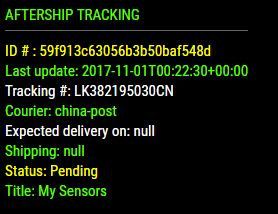

## MMM-OneTracker

Track all your deliveries using the OneTracker API
Fork of seeshaughnessy/MMM-OneTracker

## Here's what you get

A list of all your deliveries that are currently in transit.
Status, estimated delivery date, which courier, tracking number, etc. . .
Amazon, UPS, FedEx, USPS, etc..

Unlike most tracking services, OneTracker doesn't require you to link your email to it in order to auto-foward and track emails. This means you can use multiple email accounts (or multiple people!) to set up rules to forward your packages, and can see them all on your mirror!

## Examples

## Installation

- `git clone https://github.com/ooom416354/MMM-OneTracker` into the `~/MagicMirror/modules` directory.

- Sign up for a free account using the OneTracker app (There's NO API Key! Just use your username and password in the config to authenticate)

## Config.js entry and options

    {
        disabled: false,
        module: "MMM-OneTracker",
        position: "top_left",
        config: {
            username: '', // Sign up for free using the OneTracker App
            password: '',
            useHeader: true, // false if you don't want a header
            header: 'My Packages', // Change in config file. useHeader must be true
            maxWidth: '300px',
            animationSpeed: 3000, // fade speed
            initialLoadDelay: 3250,
            retryDelay: 2500,
            updateInterval: 10 * 60 * 1000, // 10 minutes
            apiLanguage: 'en',
            maxParcels: 5,
        }
    },

This module is based off of Mykle1's module, MMM-AfterShip (https://github.com/mykle1/MMM-AfterShip).
